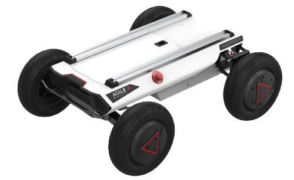

================
AgileX HUNTER SE
================

The AgileX Robotics HUNTER SE is an Ackermann front steering drive-by-wire chassis designed for the
challenging conditions and speed requirements of urban roads. It features an ultra-compact design
with speeds of 4.8m/s, and a max climbing grade of 30°. Thanks to its modular design and standard
CAN interface, users can easily install and expand various autonomous system components to
accomplish autonomous driving and commercial robot applications such as parcel delivery, unmanned
logistics, and security.

What's Here
===========

*   :doc:`getting_started` - These guides will walk you through the setup process for your HUNTER
    SE.
*   :doc:`operation` - These guides will details concepts related to the operation of the HUNTER
    SE.
*   :doc:`specifications` - Contains specification information for the HUNTER SE and related
    hardware.

Table of Contents:
==================

.. toctree::
    :maxdepth: 2
    :titlesonly:

    getting_started.rst
    operation.rst
    specifications.rst
