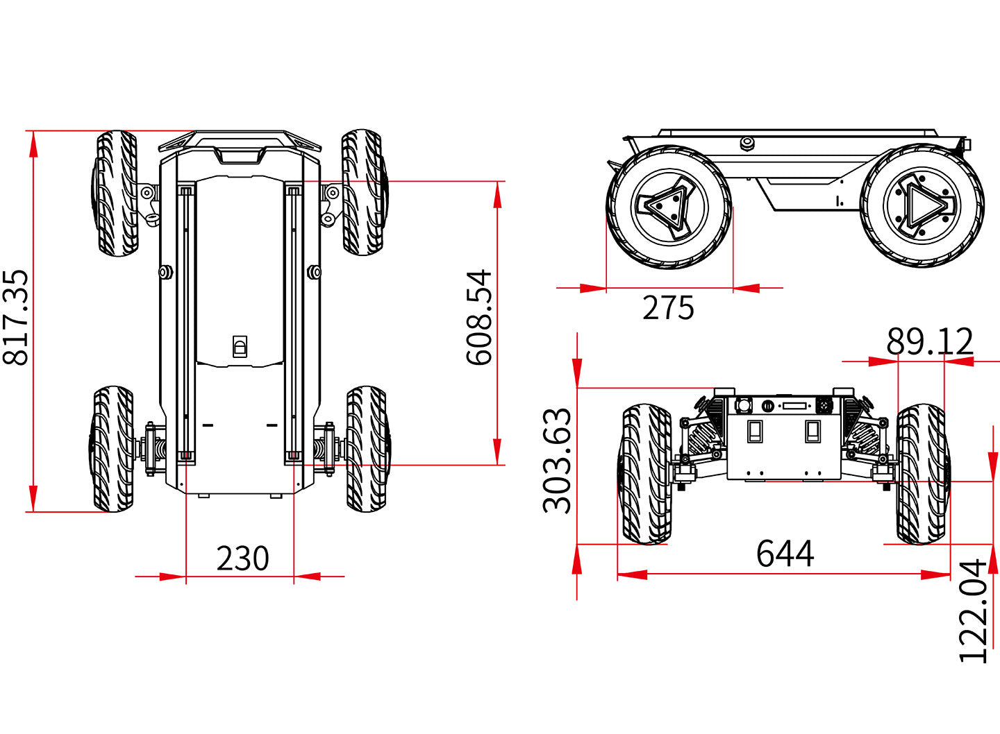

==============
Specifications
==============

.. contents::
    :local:

Bill of Materials
=================

*   1x HUNTER SE Robot Body
*   1x Battery Charger (220VAC)
*   1x Aviation Plug Male 4-Pin
*   1x USB-to-CAN Module
*   1x RC Transmitter
*   1x USB-to-RS232 Module

Specifications Overview
=======================

.. list-table::
    :align: center

    * - Dimensions
      - 820mm x 640mm x 310mm
    * - Weight
      - 42kg
    * - Payload
      - 50kg
    * - Operating Temperature
      - -20°C to 60°C
    * - Battery
      - 24V30Ah
    * - Charging Time
      - 3 hours
    * - Power Supply Output
      - 24V 15A
    * - Range (No Load)
      - Up to 30km
    * - Operating Time (No Load)
      - 2 to 3 hours
    * - Communication
      - CAN Interface
    * - Maximum Speed (No Load)
      - 4.8m/s
    * - Maximum Climbable Obstacle Height (No Load)
      - 50mm
    * - Maximum Climbable Slope (No Load)
      - 30°
    * - Minimum Ground Clearance
      - 120mm

Major Dimensions
================

